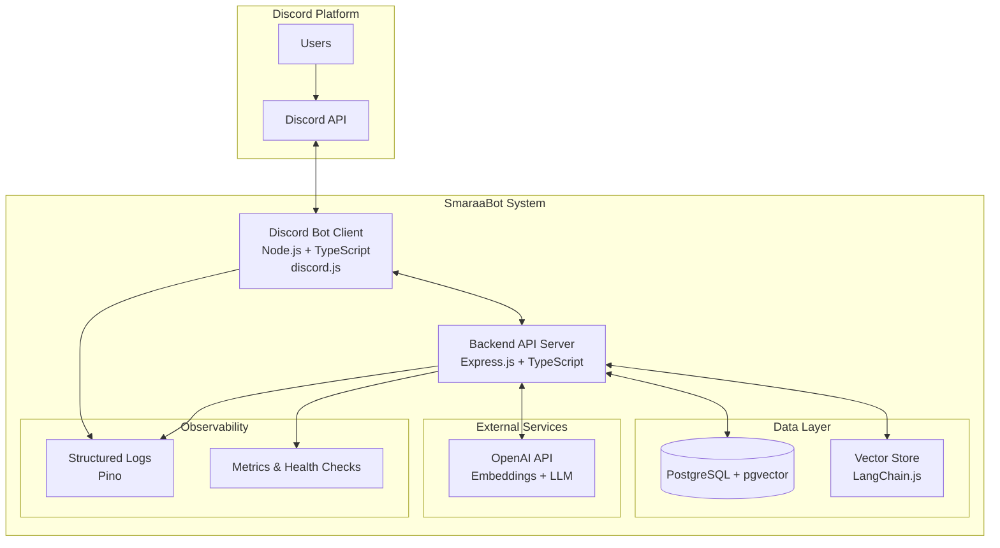
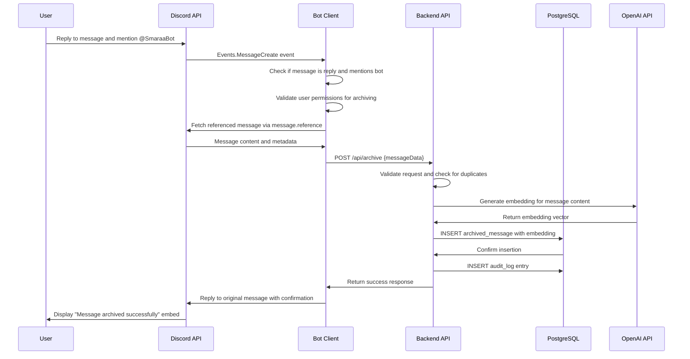
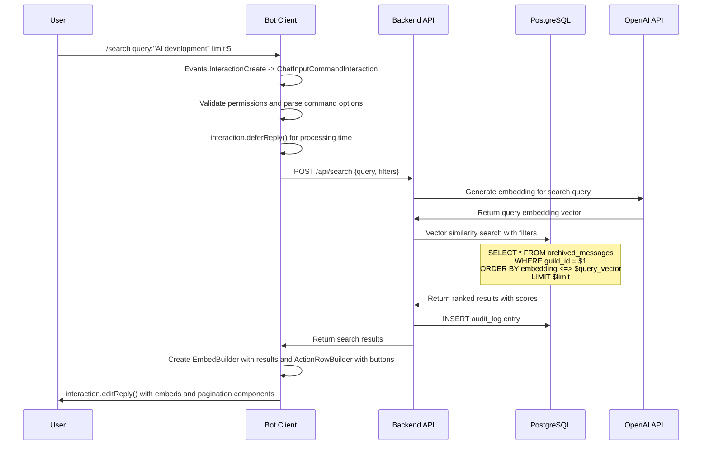
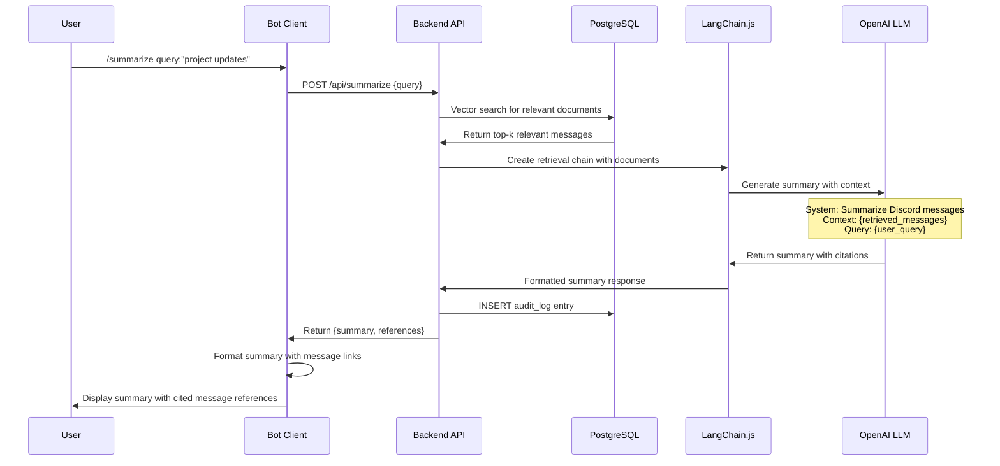
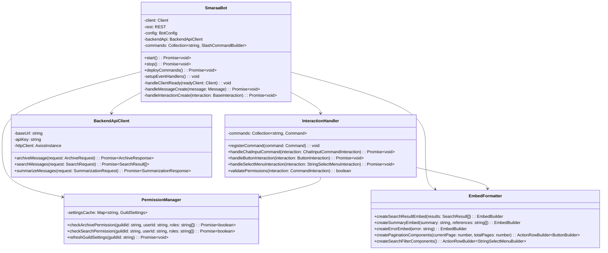
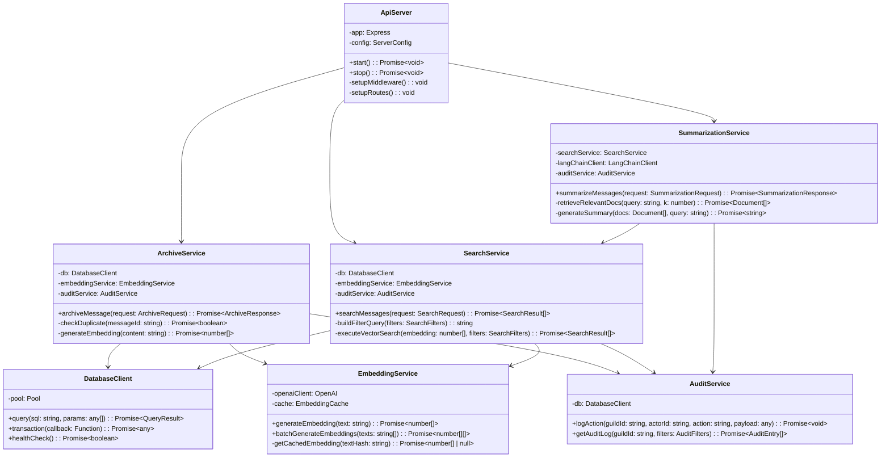
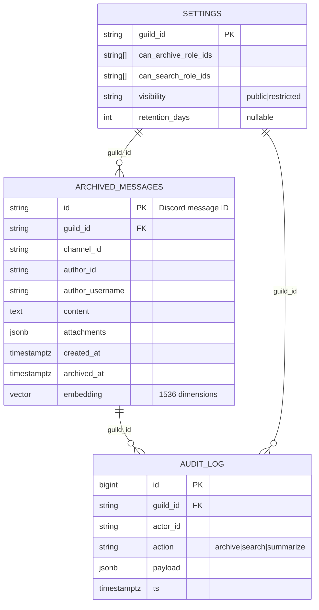

# Design Document

## Overview

SmaraaBot is a Discord bot system that provides intelligent message archiving and AI-powered search capabilities. The system consists of two main components: a Discord bot client built with discord.js and TypeScript, and a backend API server built with Express.js and TypeScript. The architecture leverages PostgreSQL with pgvector extension for vector storage, OpenAI for embeddings and LLM capabilities, and LangChain.js for retrieval-augmented generation workflows.

The system enables users to archive important Discord messages through reply mentions or slash commands, then provides semantic search and summarization capabilities across archived content. The design emphasizes performance, security, observability, and scalability to support up to 50 active Discord guilds in the initial version.

## Architecture

### High-Level Architecture



### Component Responsibilities

**Discord Bot Client:**

- Event handling for message mentions and application commands (slash commands)
- Interaction responses using Discord's interaction system with proper deferral
- Permission validation using Discord's built-in permission system
- Rate limit management via discord.js REST manager
- Payload preparation for backend API calls
- Gateway intents: `GatewayIntentBits.Guilds`, `GatewayIntentBits.GuildMessages`, `GatewayIntentBits.MessageContent`
- Command registration using REST API with Routes.applicationCommands() or Routes.applicationGuildCommands()

**Backend API Server:**

- Message archiving with deduplication
- Vector embedding generation and storage
- Semantic search with filtering capabilities
- Summarization using LangChain.js and OpenAI LLM
- Guild settings and permission management
- Audit logging and metrics collection

**Data Layer:**

- PostgreSQL for structured data storage
- pgvector extension for vector similarity search
- Optimized indexing for performance
- Data retention and cleanup policies

## Components and Interfaces

### Discord Bot Component

**Core Classes:**

- `SmaraaBot`: Main bot client extending discord.js Client with proper intents and event handlers
- `InteractionHandler`: Application command processing using ChatInputCommandInteraction and ButtonInteraction
- `PermissionManager`: Role-based access control using Discord permissions API and guild member roles
- `EmbedFormatter`: Discord embed creation using discord.js EmbedBuilder and ActionRowBuilder
- `CommandRegistry`: Slash command registration using SlashCommandBuilder and REST API

**Required Gateway Intents:**

```typescript
const intents = [
  GatewayIntentBits.Guilds, // Access to guild information
  GatewayIntentBits.GuildMessages, // Receive message events
  GatewayIntentBits.MessageContent, // Access message content (privileged intent)
];
```

**Key Interfaces:**

```typescript
// Discord.js v14+ compatible interfaces using ES modules
import {
  Client,
  Events,
  GatewayIntentBits,
  REST,
  Routes,
  SlashCommandBuilder,
} from 'discord.js';

interface BotConfig {
  token: string;
  clientId: string;
  guildIds?: string[]; // For guild-specific command deployment
  intents: GatewayIntentBits[];
  restVersion: string; // Default: '10'
}

interface ArchiveRequest {
  messageId: string;
  guildId: string;
  channelId: string;
  authorId: string;
  authorUsername: string;
  content: string;
  attachments: AttachmentInfo[];
  timestamp: Date;
}

interface SearchRequest {
  guildId: string;
  query: string;
  limit?: number;
  fromUserId?: string;
  channelId?: string;
  before?: Date;
  after?: Date;
}

interface SearchResult {
  id: string;
  content: string;
  authorId: string;
  authorUsername: string;
  channelId: string;
  createdAt: Date;
  score: number;
}
```

### Backend API Component

**Core Services:**

- `ArchiveService`: Message processing and embedding generation
- `SearchService`: Vector similarity search with filtering
- `SummarizationService`: LangChain.js integration for RAG
- `SettingsService`: Guild configuration management
- `AuditService`: Activity logging and compliance

**API Endpoints:**

- `POST /api/archive`: Archive message with embedding generation
- `POST /api/search`: Semantic search with optional filters
- `POST /api/summarize`: Generate summary with citations
- `POST /api/admin/settings`: Guild configuration management
- `GET /api/healthz`: Health check endpoint

**Authentication Middleware:**

- Shared secret validation via `X-ARCHIVE-KEY` header
- Optional IP allowlist enforcement
- Request rate limiting and abuse prevention

### Database Schema

**Core Tables:**

```sql
-- Archived messages with vector embeddings
CREATE TABLE archived_messages (
  id TEXT PRIMARY KEY,                    -- Discord message ID
  guild_id TEXT NOT NULL,
  channel_id TEXT NOT NULL,
  author_id TEXT NOT NULL,
  author_username TEXT NOT NULL,
  content TEXT NOT NULL,
  attachments JSONB DEFAULT '[]',
  created_at TIMESTAMPTZ NOT NULL,       -- Original message timestamp
  archived_at TIMESTAMPTZ NOT NULL DEFAULT now(),
  embedding VECTOR(1536)                 -- OpenAI text-embedding-3-small
);

-- Guild-specific settings and permissions
CREATE TABLE settings (
  guild_id TEXT PRIMARY KEY,
  can_archive_role_ids TEXT[],           -- Roles allowed to archive
  can_search_role_ids TEXT[],            -- Roles allowed to search
  visibility TEXT NOT NULL DEFAULT 'public', -- public | restricted
  retention_days INT                     -- NULL = no auto-delete
);

-- Audit trail for compliance and monitoring
CREATE TABLE audit_log (
  id BIGSERIAL PRIMARY KEY,
  guild_id TEXT,
  actor_id TEXT,                         -- User who performed action
  action TEXT,                           -- archive | search | summarize
  payload JSONB,                         -- Action-specific metadata
  ts TIMESTAMPTZ DEFAULT now()
);
```

**Indexing Strategy:**

- Vector similarity: `ivfflat` index on embeddings with cosine distance
- Filtering: Composite B-tree indexes on `(guild_id, channel_id, created_at)`
- Performance tuning: `lists = 100` for ivfflat, configurable `probes` parameter

## Data Models

### Message Archive Model

```typescript
interface ArchivedMessage {
  id: string; // Discord message ID
  guildId: string;
  channelId: string;
  authorId: string;
  authorUsername: string;
  content: string;
  attachments: AttachmentInfo[];
  createdAt: Date;
  archivedAt: Date;
  embedding: number[]; // 1536-dimensional vector
}

interface AttachmentInfo {
  id: string;
  filename: string;
  contentType: string;
  size: number;
  url: string;
}
```

### Guild Settings Model

```typescript
interface GuildSettings {
  guildId: string;
  canArchiveRoleIds: string[]; // Empty array = all members
  canSearchRoleIds: string[]; // Empty array = all members
  visibility: 'public' | 'restricted';
  retentionDays?: number; // undefined = no auto-delete
}
```

### Search and Summarization Models

```typescript
interface SearchQuery {
  guildId: string;
  query: string;
  limit?: number;
  filters?: {
    fromUserId?: string;
    channelId?: string;
    before?: Date;
    after?: Date;
  };
}

interface SummarizationRequest {
  guildId: string;
  query: string;
  maxDocuments?: number; // Default: 10
}

interface SummarizationResponse {
  summary: string;
  references: string[]; // Message IDs used in summary
  confidence: number; // 0-1 confidence score
}
```

## Error Handling

### Error Categories and Strategies

**Discord API Errors:**

- Rate limiting: Implement exponential backoff with jitter
- Permission errors: Graceful degradation with user-friendly messages
- Network timeouts: Retry with circuit breaker pattern

**Backend API Errors:**

- Database connection failures: Connection pooling with health checks
- OpenAI API failures: Retry with exponential backoff, fallback to cached embeddings
- Vector search timeouts: Graceful degradation with keyword search fallback

**Data Consistency Errors:**

- Duplicate message archiving: Use `ON CONFLICT DO NOTHING` for idempotency
- Embedding generation failures: Queue for retry with dead letter handling
- Search index corruption: Automatic reindexing with monitoring alerts

### Error Response Format

```typescript
interface ErrorResponse {
  success: false;
  error: {
    code: string; // ERROR_CODE_CONSTANT
    message: string; // User-friendly message
    details?: any; // Additional context for debugging
    retryable: boolean; // Whether client should retry
  };
}
```

### Resilience Patterns

**Circuit Breaker:** Protect against cascading failures from external services
**Bulkhead:** Isolate critical operations (archiving vs searching)
**Timeout:** Configurable timeouts for all external API calls
**Retry:** Exponential backoff with jitter for transient failures
**Graceful Degradation:** Fallback to basic functionality when AI services are unavailable

## Testing Strategy

### Unit Testing

- **Bot Commands:** Validate command parsing, permission checks, and response formatting
- **API Endpoints:** Test request validation, business logic, and error handling
- **Database Operations:** Mock database interactions and test query logic
- **Embedding Generation:** Mock OpenAI API responses and test vector operations

### Integration Testing

- **End-to-End Flows:** Archive message → search → summarize workflows
- **Database Integration:** Real PostgreSQL with pgvector for vector operations
- **API Contract Testing:** Ensure bot and backend API compatibility
- **Permission Enforcement:** Test role-based access control across components

### Performance Testing

- **Vector Search Performance:** Measure p95 latency with 50k archived messages
- **Concurrent Load:** Test system behavior under multiple simultaneous requests
- **Memory Usage:** Monitor embedding storage and retrieval efficiency
- **Rate Limit Handling:** Validate Discord API rate limit compliance

### Security Testing

- **Authentication:** Verify API key validation and IP allowlist enforcement
- **Authorization:** Test role-based permissions and data isolation
- **Input Validation:** SQL injection, XSS, and malformed payload protection
- **Data Privacy:** Ensure proper data handling and retention compliance

### Test Data Management

- **Fixtures:** Standardized test messages with known embeddings
- **Seeding:** Automated database population for performance testing
- **Cleanup:** Isolated test environments with automatic teardown
- **Mocking:** External service mocks for reliable, fast testing

### Continuous Testing

- **Automated Test Suite:** Run on every commit with quality gates
- **Performance Regression:** Automated performance benchmarking
- **Security Scanning:** Static analysis and dependency vulnerability checks
- **Integration Monitoring:** Synthetic transactions in production environment

## Sequence Diagrams

### Archive Message Flow



### Search Flow



### Summarization Flow



## Class Diagrams

### Bot Client Architecture



### Backend API Architecture



### Data Model Relationships


