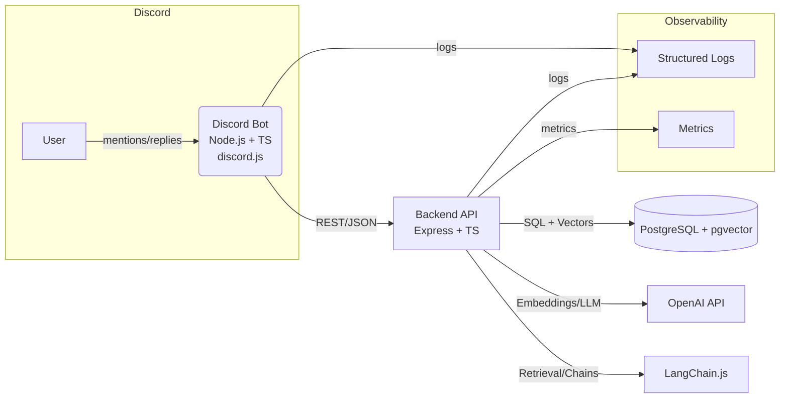
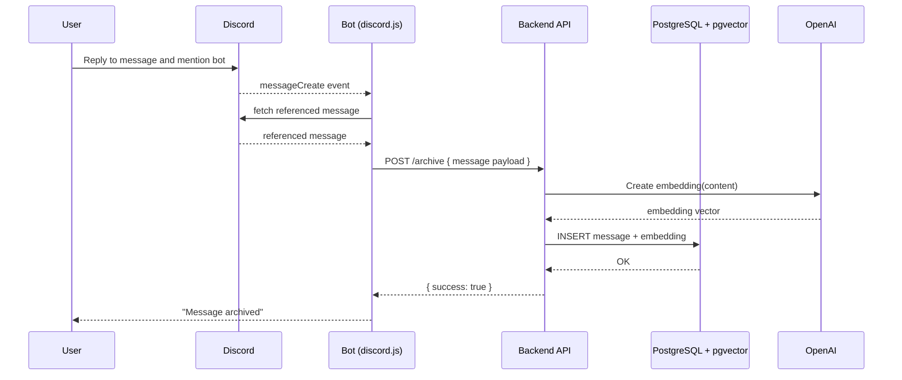
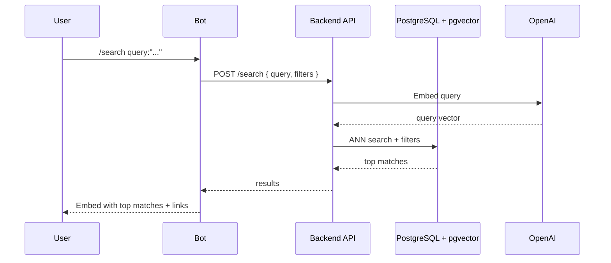
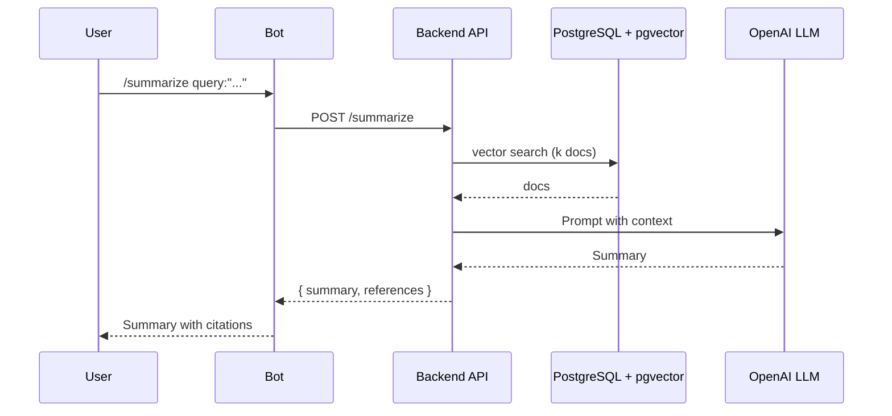

# Discord SmaraaBot — Technical Design Document

**Status:** Draft v1.0  
**Date:** 2025-09-07  
**Owner:** <you>

---

## 1. Purpose and Scope

Build a Discord bot that archives any message it is tagged on as a reply, and offers AI search across archived content. The bot is implemented in Node.js with TypeScript using discord.js. The backend is an Express API using PostgreSQL with pgvector for vector search. OpenAI provides embeddings and LLM. LangChain.js orchestrates retrieval and agent workflows.

In scope: core archiving, semantic search, summarization, role-based access, operational readiness, and production-grade optimizations.

Out of scope (v1): cross-server federation, web dashboard UI, full-text OCR for images, translation.

---

## 2. Requirements

### 2.1 Functional Requirements

1. **Archive by reply mention**: When a user replies to a message and mentions the bot, the referenced message is archived with metadata and attachments info.
2. **Slash commands**:
   - `/archive` (when used as a reply) to archive the referenced message.
   - `/search query:"..." limit:N from:@user channel:#channel before:date after:date` returns top matches.
   - `/summarize query:"..."` returns a concise summary of the most relevant archived messages.
3. **Semantic search**: AI search using vector similarity. Results include snippet, author, channel, timestamp, and a deep link to the original message.
4. **Filters**: by user, channel, and time range.
5. **Permissions**: configurable per guild. Admins control who can archive and who can search. Private vs public results toggle.
6. **Deduplication**: do not re-ingest the same Discord message ID.
7. **Resilience**: operations are idempotent where possible. Retry transient failures.
8. **Observability**: structured logs, metrics, and basic audit trail for archive and search events.

### 2.2 Non-Functional Requirements

- **Performance**: search p95 latency < 600 ms at 50k archived messages with pgvector ANN index.
- **Cost**: use `text-embedding-3-small` by default. Configurable upgrade.
- **Security**: bot token in secret store. Backend protected by auth token and IP allowlist. Least-privilege database role.
- **Scalability**: support 50 active guilds in v1. Vertical scaling plus pg tune. Sharding not required in v1.
- **Reliability**: no data loss on normal restarts. Regular backups. Graceful shutdown.
- **Compliance**: per-guild data retention policy settings.

### 2.3 Assumptions and Constraints

- Discord API rate limits enforced by discord.js.
- Postgres with pgvector available and managed via container or cloud service (e.g., Supabase or RDS with extension enabled).
- OpenAI API accessible from backend region.

---

## 3. High-Level Architecture



Key points:

- Bot is a thin event and presentation layer.
- Backend centralizes persistence, embeddings, retrieval, and summarization.
- pgvector enables ANN search with `ivfflat` or `hnsw` index.

---

## 4. Data Model and Storage

### 4.1 Tables

- **archived_messages**
  - `id TEXT PRIMARY KEY` Discord message ID
  - `guild_id TEXT NOT NULL`
  - `channel_id TEXT NOT NULL`
  - `author_id TEXT NOT NULL`
  - `author_username TEXT NOT NULL`
  - `content TEXT NOT NULL`
  - `attachments JSONB DEFAULT '[]'`
  - `created_at TIMESTAMP WITH TIME ZONE NOT NULL` original message timestamp
  - `archived_at TIMESTAMP WITH TIME ZONE NOT NULL DEFAULT now()`
  - `embedding VECTOR(1536)` dimension must match embedding model

- **settings** (per guild)
  - `guild_id TEXT PRIMARY KEY`
  - `can_archive_role_ids TEXT[]` optional
  - `can_search_role_ids TEXT[]` optional
  - `visibility TEXT NOT NULL DEFAULT 'public'` enum: public, restricted
  - `retention_days INT` nullable; null means no auto-delete

- **audit_log**
  - `id BIGSERIAL PRIMARY KEY`
  - `guild_id TEXT`
  - `actor_id TEXT`
  - `action TEXT` enum-like: archive, search, summarize
  - `payload JSONB`
  - `ts TIMESTAMP WITH TIME ZONE DEFAULT now()`

### 4.2 Indexing Strategy

- `archived_messages(embedding)` with `ivfflat` cosine ops and `lists = 100` in v1.
- `archived_messages(guild_id, channel_id, created_at)` btree for filters.

### 4.3 Example SQL

```sql
CREATE EXTENSION IF NOT EXISTS vector;

CREATE TABLE IF NOT EXISTS archived_messages (
  id TEXT PRIMARY KEY,
  guild_id TEXT NOT NULL,
  channel_id TEXT NOT NULL,
  author_id TEXT NOT NULL,
  author_username TEXT NOT NULL,
  content TEXT NOT NULL,
  attachments JSONB DEFAULT '[]',
  created_at TIMESTAMPTZ NOT NULL,
  archived_at TIMESTAMPTZ NOT NULL DEFAULT now(),
  embedding VECTOR(1536)
);

-- ANN index for cosine similarity
CREATE INDEX IF NOT EXISTS archived_messages_embedding_ivfflat
ON archived_messages USING ivfflat (embedding vector_cosine_ops) WITH (lists = 100);

-- Filter helpers
CREATE INDEX IF NOT EXISTS archived_messages_guild_idx
ON archived_messages (guild_id, channel_id, created_at);

CREATE TABLE IF NOT EXISTS settings (
  guild_id TEXT PRIMARY KEY,
  can_archive_role_ids TEXT[],
  can_search_role_ids TEXT[],
  visibility TEXT NOT NULL DEFAULT 'public',
  retention_days INT
);

CREATE TABLE IF NOT EXISTS audit_log (
  id BIGSERIAL PRIMARY KEY,
  guild_id TEXT,
  actor_id TEXT,
  action TEXT,
  payload JSONB,
  ts TIMESTAMPTZ DEFAULT now()
);
```

---

## 5. API Design (Backend)

Base URL: `https://<backend>/api`

### 5.1 Auth

- Bot sends `X-ARCHIVE-KEY: <shared-secret>` header.
- Optional IP allowlist.

### 5.2 Endpoints

- `POST /archive`
  - Body: `{ id, guildId, channelId, authorId, authorUsername, content, attachments, timestamp }`
  - Behavior: Upsert archived message, compute embedding, store.
  - Returns: `{ success: true }`

- `POST /search`
  - Body: `{ guildId, query, limit?, fromUserId?, channelId?, before?, after? }`
  - Behavior: Embed query, perform vector similarity with optional filters.
  - Returns: `[{ id, content, authorId, authorUsername, channelId, created_at, score }]`

- `POST /summarize`
  - Body: `{ guildId, query, k? }`
  - Behavior: Retrieve top-k docs, produce summary with LLM.
  - Returns: `{ summary, references: [messageIds] }`

- `POST /admin/settings`
  - Body: `{ guildId, canArchiveRoleIds?, canSearchRoleIds?, visibility?, retentionDays? }`
  - Returns: updated settings

- `GET /healthz`
  - Liveness probe.

### 5.3 Query Semantics

- Vector search via `ORDER BY embedding <=> $1 LIMIT $n` for cosine.
- Filters applied by sub-select of candidate set, or pre-filter using btree indexes followed by re-ranking.
- Optional `probes` session parameter tuning for ivfflat.

---

## 6. Bot Design (discord.js + TS)

### 6.1 Commands and Events

- **Mention or `/archive`** while replying to a message triggers fetch of referenced message and POST `/archive`.
- **`/search`** collects options and posts results as Discord embeds, with pagination buttons.
- **`/summarize`** calls backend and displays the summary with references.
- **Guild settings** managed via `/archiveset` subcommands or via backend admin endpoint.

### 6.2 Message Deep Links

- Use `https://discord.com/channels/<guild>/<channel>/<messageId>` for jump links in search results.

### 6.3 Rate Limiting

- Use discord.js built-in queueing and avoid hot loops. Backoff on HTTP 429.

---

## 7. Sequence Diagrams

### 7.1 Archive by Reply Mention



### 7.2 AI Search



### 7.3 Summarize



---

## 8. LangChain.js Retrieval and RAG

- **Vector store**: Custom PGVector adapter or `@langchain/community/vectorstores/pgvector`.
- **Retriever**: `asRetriever({ k: N })` for top-N docs.
- **Prompting**: system prompt guiding concise, faithful answers. Include message IDs to allow citations.
- **Agent (v2)**: optional tools for “search”, “summarize”, and “filter by channel”.

---

## 9. Embeddings and Models

- Default embeddings: `text-embedding-3-small` (1536 dims).
- Optional upgrade: `text-embedding-3-large` for higher recall at higher cost.
- LLM: `gpt-4o-mini` for summaries. Fall back to `gpt-4o-mini` with shorter context for cost control.

---

## 10. Security and Privacy

- **Secrets**: BOT_TOKEN, OPENAI_API_KEY, ARCHIVE_API_KEY in secret manager or env injection.
- **Network**: backend private network, IP allowlist for bot host. HTTPS only.
- **AuthZ**: per-guild roles for archive/search. Server admins can override.
- **PII**: store only usernames and IDs needed for functionality. Optional anonymization setting.
- **Retention**: prune data per `retention_days`. Scheduled job deletes expired rows and reindexes.

---

## 11. Operational Readiness

- **Logging**: pino for JSON logs with trace IDs.
- **Metrics**: basic counters and histograms (archive count, search latency, LLM calls).
- **Health checks**: `/healthz` and DB ping.
- **Backups**: daily logical backup, 7-day retention.
- **Migrations**: managed via drizzle-kit or knex. Immutable, forward-only migrations.

---

## 12. Performance and Tuning

- pgvector `ivfflat` lists = 100, tune `SET ivfflat.probes = 10` per session for better recall.
- Consider `hnsw` index in Postgres 17+ if available in target environment.
- Cache embeddings for identical content hashes to avoid re-embedding duplicates.
- Batch inserts when archiving threads.

---

## 13. Error Handling and Retries

- Use exponential backoff on OpenAI failures. Circuit breaker if rate limited.
- Idempotent archive via `ON CONFLICT DO NOTHING` on message ID.
- Graceful shutdown with in-flight request drain.

---

## 14. Testing Strategy

- **Unit**: parsing commands, role checks, payload shaping.
- **Integration**: archive → DB insert → search flow with a test Postgres.
- **Contract**: OpenAPI or TS types shared between bot and backend.
- **Load**: seed 50k rows and measure p95 search latency.
- **Security**: auth header required, negative tests for unauthorized calls.

---

## 15. Deployment

- **Bot**: container on Railway/Fly.io or k8s Deployment.
- **Backend**: container with health probes.
- **DB**: managed Postgres with pgvector (Supabase or RDS+extension).
- **Config**: env vars via secrets manager.

### 15.1 Environment Variables

- `DISCORD_BOT_TOKEN`
- `BACKEND_URL`
- `ARCHIVE_API_KEY`
- `DATABASE_URL`
- `OPENAI_API_KEY`
- `EMBEDDING_MODEL` default `text-embedding-3-small`
- `LLM_MODEL` default `gpt-4o-mini`

---

## 16. Risks and Mitigations

- **OpenAI outages**: queue and retry, local cache for embeddings, allow switching providers.
- **DB growth**: implement retention and optional attachments offloading.
- **Abuse**: rate limit commands per user and per guild.
- **Privacy**: clear disclosure and opt-out per guild.

---

## 17. Acceptance Criteria

1. Reply mention archives the referenced message and confirms success.
2. `/search` returns relevant results with correct links and metadata. p95 < 600 ms at 50k rows.
3. `/summarize` produces a coherent summary citing message IDs.
4. Role-based restrictions enforced.
5. Health checks pass. Metrics observable.

---

## 18. Work Breakdown Structure and Task List

### Milestone 1: Project Setup (1 week)

- [ ] Repo bootstrap with Node.js + TS workspaces for bot and backend.
- [ ] Linting, formatting, commit hooks.
- [ ] Dockerfiles and docker-compose for local DB with pgvector.
- [ ] Basic health check endpoint.

### Milestone 2: Database and Migrations (2 days)

- [ ] Create tables `archived_messages`, `settings`, `audit_log`.
- [ ] Create pgvector index and btree indexes.
- [ ] Seed scripts and fixtures.

### Milestone 3: Backend Archive API (3 days)

- [ ] `/archive` route with validation.
- [ ] OpenAI embeddings integration.
- [ ] Insert with `ON CONFLICT DO NOTHING`.
- [ ] Unit and integration tests.

### Milestone 4: Bot Archive Flow (3 days)

- [ ] discord.js client with intents.
- [ ] Reply mention and `/archive` command.
- [ ] Payload shaping and POST to backend.
- [ ] Confirmation messages and error states.

### Milestone 5: Search API and Bot UI (4 days)

- [ ] `/search` route with filters and ANN search.
- [ ] Pagination support and scoring in responses.
- [ ] Bot embeds with jump links and buttons.
- [ ] Performance test at 50k rows.

### Milestone 6: Summarization and RAG (3 days)

- [ ] `/summarize` route using LangChain retriever.
- [ ] Prompt templates and grounding with citations.
- [ ] Bot display of summary and references.

### Milestone 7: Settings, RBAC, and Retention (3 days)

- [ ] `/admin/settings` endpoint.
- [ ] Guild role checks in bot.
- [ ] Scheduled retention job and reindexing.

### Milestone 8: Observability and SRE (3 days)

- [ ] Structured logging with pino.
- [ ] Basic metrics exporter.
- [ ] Alerts for error rates and latency.

### Milestone 9: Hardening and Launch (1 week)

- [ ] Security review, token rotation.
- [ ] Load and soak testing.
- [ ] Runbook and docs.

---

## 19. Future Enhancements

- Web dashboard with analytics.
- Thread-level archiving and bulk operations.
- Cross-guild federation for multi-server organizations.
- OCR for image attachments and PDF text extraction.
- Multilingual embeddings and translation.

---

## 20. Appendix

### 20.1 Example Search SQL

```sql
WITH q AS (
  SELECT $1::vector AS embedding
)
SELECT id, content, author_id, author_username, channel_id, created_at,
       1 - (archived_messages.embedding <#> (SELECT embedding FROM q)) AS cosine_sim
FROM archived_messages
WHERE guild_id = $2
ORDER BY archived_messages.embedding <=> (SELECT embedding FROM q)
LIMIT $3;
```

### 20.2 Example Prompt for Summarization

```
System: You are an assistant that summarizes Discord discussions faithfully.
User: Summarize the following archived messages in the context of "{query}". Include message IDs for citations.
Context:
{top_k_messages}
```
